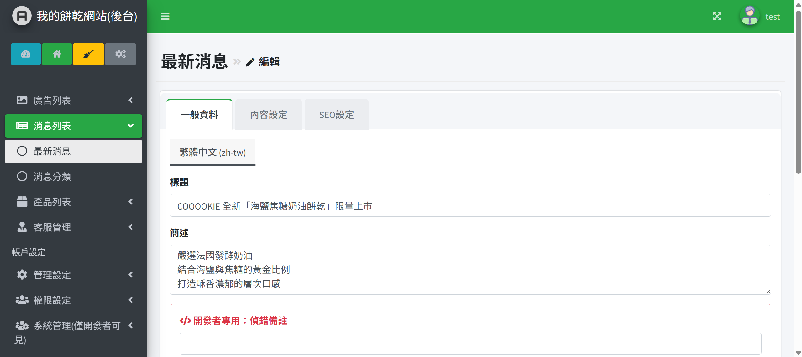
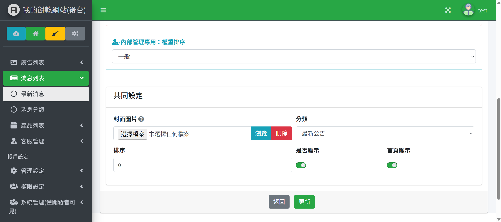
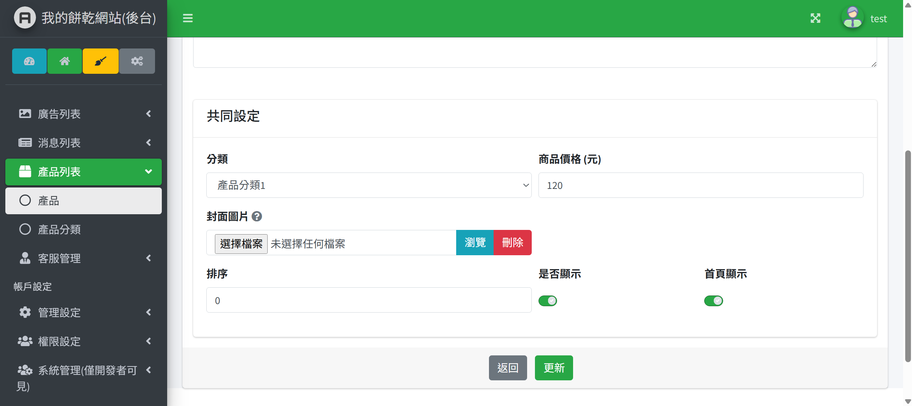
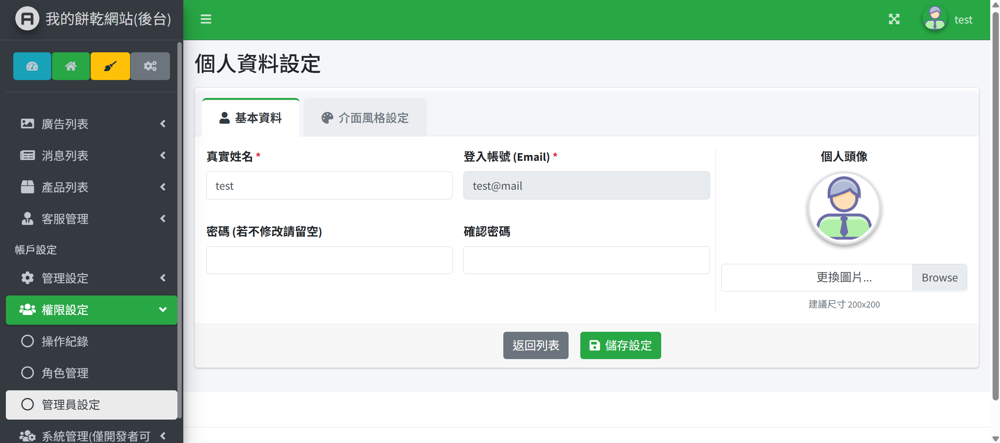
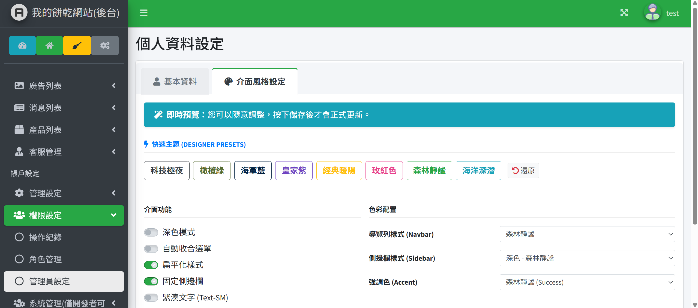
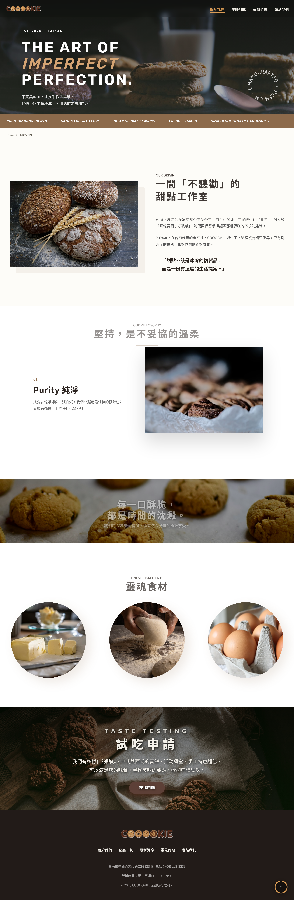

  # 【COOOOKIE】餅乾型錄網站 - 相關說明

  ## ● 開發環境與核心技術

  - '開發環境': PHP 8.2 / Laravel 12.21.0 / MySQL 8.0

  - '核心套件':
      - '認證與安全性': Laravel Breeze (登入/註冊), Laravel Sanctum (API 認證)
      - '後端效能': Laravel Task Scheduler & Queue (背景任務處理)
      - '測試驅動': PHPUnit (主要功能都有做單元測試)

  - '系統監控與日誌':
    - 'Log 管理工具': opcodesio/log-viewer (^3.21)（後台錯誤與系統日誌檢視）

  - '前端技術': HTML5 , CSS , jQuery 3.7, Javascript

  - 'UI/UX 工具': AdminLTE 3 (後台模板), Summernote (內容編輯器)

---

<!--
  ## ● 安裝與測試說明
  * '環境準備':
      1. 'composer install'
      2. 'cp .env.example .env' (配置 DB 資訊)
      3. 'php artisan migrate --seed' (包含基礎權限資料)
      4. 'npm install && npm run dev'
  * '單元測試': 執行 'php artisan test' 確保核心邏輯與權限驗證正確無誤。
 -->

  ---

  ## ● 系統功能說明與前後台介面展示

  ### A. 後台管理系統 (CMS)

  #### '※ 廣告管理 (Advert Management)'

  - **介面預覽**: 
  - **功能描述**: 用來管理全站的輪播圖、廣告橫幅跟分類，也有支援多語系。
  - **特殊邏輯**:
      - 廣告跟分類是拆開的（'AdvertCategory'），可以讓同一組廣告分不同區塊或排序去用
      - 多語系內容放在 'AdvertDesc'，切換語言時前台會自動換內容
  - **防呆與參數**: 圖片限制 2MB，只有 jpg/png，路徑全部由 'ImageHelper' 控制，避免亂塞檔案
  - **可操作角色**: 最高管理員、有權限的客戶管理員

  #### '※ 最新消息管理 (News Management)'

  - **介面預覽**: 

  

    
    
  

  - **功能描述**: 用來管理網站公告、活動消息，可以設定發布狀態跟首頁置頂
  - **特殊邏輯**: 分類、內容、多語系（'NewsDesc'）是分開的，讓主表比較乾淨
  - **可調整參數**: 排序權重、是否要顯示在首頁

  #### '※ 產品管理 (Product Catalog)'

  - **介面預覽**: 
  - **功能描述**: 管理整個 COOOOKIE 的餅乾品項、分類跟詳細內容
  - **技術亮點**: Summernote 編輯器有串 'SummernoteImageHelper'，圖片會自動存成檔案，不會用 Base64 塞資料庫
  - **可操作角色**: 客戶管理員（主要做上下架）

  #### '※ 客服回覆管理 (Contact Customer Service)'

  - **介面預覽**: 
  - **功能描述**: 用來看前台留言並直接回覆
  - **技術亮點**: 回覆送出後會丟進 Queue，再用 'Mail/ContactNotification' 非同步寄信，前台操作不會卡

  #### '※ 語系核心設定 (Language Settings)'

  - **介面預覽**: 
  - **功能描述**: 管理網站有哪些語言，還有預設語系
  - **操作特性**: 語系新增或刪除會直接影響全站多語系資料（'Desc Tables'）

  #### '※ 管理員操作紀錄 (Action Logs)'

  - **介面預覽**: 
  - **功能描述**: 後台所有操作都會被記錄下來，避免誤操作或越權
  - **技術亮點**: 用 'Loggable' Trait，自動記錄 CRUD 的人、時間、內容，不用每個 Controller 重寫

  #### '※ 角色權限管理 (Role & RBAC)'

  - **介面預覽**: 
  - **功能描述**: 可以細到每個選單的權限設定
  - **核心邏輯**: 改完權限後會透過 'CheckBackendPermission' Middleware 即時擋掉非法操作

  #### '※ 後台管理員設定 (Admin Users)'

  - **介面預覽**: 

  

    
    
  

  - **功能描述**: 管理後台帳號（新增 / 停用 / 指派角色）
  - **特殊邏輯**: 為了避免系統壞掉，非開發人員不能動或刪掉預設開發員帳號

  <!-- #### '※ 系統錯誤日誌 (System Logs) - 僅開發者可見'
  * **介面預覽**: 
  * **功能描述**: 使用套件「Log Viewer」讀取底層框架與伺服器發生的異常、警告與錯誤。 -->

  #### '※ 通用圖片上傳組件 (Universal Image Uploader)'

  - **介面預覽**: 
  - **功能描述**: 廣告、產品、消息共用的圖片處理工具
  - **技術亮點**: 全部由 'ImageHelper' 控制，會自動 Hash、壓縮、分類存檔，避免資料夾亂掉

  ---

  ### B. 前台使用者介面 (Frontend UI/UX)

  #### '※ 首頁 (Home Page)'

  - **頁面預覽**: 

  - **視覺風格**: 用比較溫暖的手作餅乾風格，Banner、商品、消息區塊會一起動，看起來比較有層次
  - **前端互動**: 用 jQuery 做輪播，點卡片會滑到詳細頁

  #### '※ 關於我們 (About Me Page)'

  - **頁面預覽**: 

  - **視覺風格**: 延續首頁的配色跟風格，整體是同一套設計語言
  - **前端互動**: 一樣用 jQuery 控制輪播跟頁面跳轉

  #### '※ 商品型錄列表 (Product List)'

  - **頁面預覽**: 

  - **排版結構**: 卡片式網格，手機跟電腦都能正常看
  - **前端互動**: 不用重整頁面就能分類、排序、分頁
  - **結構化標籤**: 用 '<article>' 搭配標題層級，SEO 比較好抓

  #### '※ 最新消息公告 (News Center)'

  - **頁面預覽**: 

  - **呈現方式**: 卡片 + 清單混合，依時間排序，也可以篩選分類

  #### '※ 聯絡我們表單 (Contact Us)'

  - **頁面預覽**: 

  - **互動亮點**: 表單有做即時檢查（空值 / Email 格式）
  - **UX 設計**: 送出後按鈕會 disabled，並顯示「處理中...」，避免重複送出造成後端重複寫入資料
