readme_content: |
  # 【COOOOKIE】餅乾型錄與後台管理系統

  本專案是一個具備多語系架構的商品型錄網站，包含前台展示（首頁、最新消息、產品型錄、聯絡我們）與後台管理系統（CMS）。

  ## 1. 系統環境與依賴套件
  * **核心框架**: PHP 8.2 / Laravel 12.21.0
  * **資料庫**: MySQL 8.0
  * **核心套件**: 
    - Laravel Breeze (基礎帳號認證)
    - Laravel Sanctum (API 認證基礎)
  * **前端工具**: 前端工具**:
    - HTML5 / CSS
    - jQuery 3.7
    - AdminLTE 3（後台介面）
    - Summernote (網頁編輯器)

  ---
  <pre>
  【前台使用者介面】(首頁/消息/關於/產品/聯絡我們)
         │
         ▼ (填寫聯絡表單、瀏覽產品)
  【Laravel 路由中心 (Routes)】
         │
         ▼ (進入控制層，前後端邏輯徹底分離)
  【Controllers 控制器】 ─── (依賴/調用) ───► 【Helpers / Traits 靜態工具箱】
         │                                         │
         ▼ (標準 Eloquent ORM)                      ▼ (自動化防呆)
  【Models 資料模型】                               • ImageHelper (圖片縮放/補白)
         │                                         • SummernoteImageHelper (編輯器刪圖清理)
         ▼ (結構化儲存)                             • ContentHelper (網址標籤化 [[SITE_URL]])
  【MySQL 資料庫】 ◄────────── (聯動刪檔) ───────────• HasImageFields (資料刪除時自動清空實體圖)
  </pre>

  
  ---

  ## 2. 後台管理系統 (CMS) - 模塊化設計與防呆邏輯

  這個專案主要透過自訂的 Helpers、Traits 與 Middleware 來分擔 Controller 的負擔，維持程式碼的重複利用性。

  為了讓程式好維護，我採用 **Controller 職責單一** 的設計，Controller 只負責接收 Request 與回傳 Response，不處理複雜的圖檔裁切或字串過濾。

  另外，系統中沒有寫死的 `config/site.php` 檔案，所有全域設定都存在 `system_settings` 資料表中，在系統啟動時透過 `AppServiceProvider` 動態塞入記憶體中（`Config::set()`），方便客戶以後直接在後台修改系統參數。

  ### 產品、消息與廣告管理 (多語系架構)
  * **功能描述**: 針對不同內容（Product/News/Advert）建立獨立 Model 與 Desc 關聯表，支援橫向擴充語系。
  * **核心邏輯與防呆**: 
    - 採用主表與描述表分離的設計（例如 `news` 與 `news_desc`），以後如果要擴充其他語言，完全不需要更動到主表的結構。
    - 圖片上傳透過 `ImageHelper` 進行檔案格式、大小驗證，並依功能別（adv, product）自動分類儲存。
    - 掛載了 `HasImageFields` Trait。當管理員執行刪除資料時（`$model->delete()`），會自動觸發 Model 的 `deleted` 事件，透過 `ImageHelper` 連動刪除實體硬碟中的圖檔，避免產生不必要的垃圾檔案。
    - 抽離了 `Loggable` Trait，可以自動記錄各模組操作紀錄。支援動態排序、顯示狀態調整。廣告模組具備區塊 (Category) 投遞邏輯。
  
  

  ### 客服管理與郵件通訊
  * **功能流程**: 用戶提交聯絡表單 -> `Contact` 紀錄生成 -> 管理員回覆 -> 觸發 `Mail/ContactNotification` 郵件通知。
  * **核心邏輯與防呆**: 
    - 前台使用者提交聯絡表單後，資料會存入 `contact` 表（狀態預設為 0，未讀）。管理員在後台查看時，狀態自動變更為 1（已讀）；透過 Summernote 編輯器提交回覆後，狀態變更為 2（已回覆），方便企劃或管理人員追蹤進度。
    - 為了避免發送郵件造成網頁卡頓，回覆信件採用了非同步發送（整合 Laravel Queue 機制），確保用戶體驗不受郵件發送時間影響。
    - 寄信前會透過 `MailConfigHelper` 從資料庫動態撈取並套用當前的 SMTP 設定。
  
  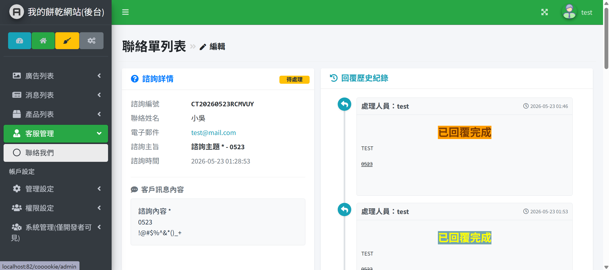

  ### 權限與系統紀錄
  * **角色分級**: `開發員` (結構維護)、`內部最高管理員` (全站管理)、`客戶管理員` (內容維運)。
  * **核心邏輯與防呆**: 
    - **路由攔截**: 透過 `CheckBackendPermission` 中介層攔截請求，並呼叫 `User::canDo()` 比對目前角色的權限清單，無權限者會被導回原頁面並跳出錯誤提示。
    - **操作稽核**: 透過 `Loggable` Trait 自動監聽或手動觸發 `writeLog()`，將管理員的 CRUD 行為詳細格式化記錄至 `ActionLog` 資料表，包含操作人、時間與具體行為。
  
  

  ---

  ## 3. 核心邏輯與架構分析

  ### 後台權限控管
  我把後台權限拆分成 **「CheckBackendPermission 中間件（負責守門攔截）」** 與 **「PermissionHelper 輔助工具（負責資料加工）」** 。
  * **CheckBackendPermission (守門攔截)**: 
    - 它就像是後台的「警衛」。每當管理員點擊功能時，會第一時間進行路由攔截。
    - 系統會自動判斷該名管理員是否登入、是否有該功能的鑰匙（權限）。
    - **防呆與細節**: 當發現無權限時，它會利用 `BaseAdminController::showMsg` 將錯誤訊息塞入快閃 Session，並自動計算前一頁網址跳轉回去。跳轉時會帶上 `withInput()` 確保管理員剛剛填寫的表單內容不會平白無故消失。
  * **PermissionHelper (資料加工工具箱)**:
    - 扮演專門整理權限設定檔的「資料處理器」，不參與網頁跳轉，只專注於資料的重用性。
    - **效能優化 (靜態快取)**: 內建 `$cachedMap` 機制。在同一次網頁請求中，只要解析過一次複雜的權限設定檔（`config/backend_permissions.php`），就會暫存在記憶體中，避免重跑迴圈造成效能浪費。
    - **表單自動化調整**: 當高階管理員要修改員工權限時，`preparePermissionsForForm()` 會自動計算權限結構、勾選狀態（`checked`）及功能相依性（`depends`），自動包裝成乾淨的樹狀陣列丟給前端網頁，方便後台直接渲染出 Checkbox 勾選清單。

  ### 圖片管理與 Summernote 整合
  * **核心邏輯**: Summernote 上傳時由 `SummernoteImageHelper` 攔截，將圖片轉存為實體檔案而非儲存在資料庫（避免 DB 肥大）。
  * **路徑管理**: 統一儲存於 `public/storage/`，透過軟連結 (Symbolic Link) 實現前端安全存取。
  * **網址標籤化防破圖**: 為了避免網站搬家（更換網域）時圖檔破圖，富文本編輯器中的圖片網址在存入資料庫前，都會透過 `ContentHelper` 將絕對路徑取代為 `[[SITE_URL]]`。
  * **編輯器圖片防呆機制**: 為了防止編輯器產生冗餘圖檔，`SummernoteImageHelper` 具備以下機制：
    - **儲存時比對**: 自動比對新舊 HTML 內容，利用 `array_diff` 找出被使用者手動刪除的圖片，並將其實體檔案從硬碟移除。
    - **過期清理**: 在使用者進入表單時，自動檢查 Session 紀錄，若有上傳超過 1 小時且未存檔的暫存圖，會予以清理。
  
  

  ### 後端維運機制
  * **背景任務**: 使用 `Task Scheduler` 定期清理系統紀錄或更新快取。
  * **任務隊列**: `Queue` 處理耗時任務（如發送聯絡表單通知信），提升系統回應速度。

  ---

  ## 4. 前台呈現與風格 (User Experience)

  ### 呈現風格與互動
  * **首頁佈局**: 整合 Banner 輪播、精選產品與最新消息，採分區明確的區塊化設計。採用溫暖的手作餅乾品牌主色，jQuery 動態驅動 Banner 輪播切換，點擊卡片平滑導向詳情頁。
  * **產品列表**: 採用 **網格卡片式 (Card Grid)** 排版，兼顧視覺飽滿度與 RWD 適應性。支援無重新整理的 jQuery 動態分類篩選與分頁。
  * **產品詳情**: 採左圖右文的排版。左側產品圖支援 jQuery 點擊互動放大與多圖切換，右側重點商品規格加粗顯示。
  
  

  ### SEO（搜尋優化）與 RWD（響應式網頁）
  * **適應各種螢幕（RWD）**: 寫網頁時有仔細微調過，確保不論是在 4K 大型螢幕、日常桌機、筆記型電腦、iPad 平板、甚至是各式大小的手機上，版面都不會亂掉、不會破圖。
  * **搜尋引擎優化（SEO）**: 網頁標籤有用比較符合語意的結構（例如 `<article>`），讓 Google 的機器人比較好爬。網頁的標題、關鍵字和描述都可以直接在後台的系統設定裡修改，方便隨時做搜尋優化。

  ---

  ## 5. 資料流與系統邏輯 (ASCII 流程圖)

  ### 後台權限攔截與資料處理流程
  <pre>
  【管理員發送請求】(例如：點擊刪除產品)
         │
         ▼
  【CheckBackendPermission 中間件】──(無權限)──►【BaseAdminController::showMsg】──►【退回前一頁並保留表單輸入】
         │ (驗證通過放行)
         ▼
  【Controllers 控制器】
         │ (當需要渲染員工權限設定頁面時)
         ▼
  【PermissionHelper 輔助工具】
         ├───► 檢查 $cachedMap 靜態快取 (避免重複跑迴圈浪費效能)
         └───► 讀取 config('backend_permissions') ───►【加工成樹狀陣列】───►【丟給前端 Blade 產生 Checkbox】
  </pre>

  ### 後台 CRUD 與圖片上傳資料流
  <pre>
  [Request] -> [Request Class 驗證] -> [Controller] 
                                           |
                          -----------------------------------
                          |                |                |
                  [ImageHelper]    [Desc Model]     [Main Model]
                          |                |                |
                  [Storage/Files]   [多語系內容]       [主體紀錄]
  </pre>

  ### 背景任務流程 (Queue/Mail)
  <pre>
  [前台表單提交] -> [Controller 存入資料庫] -> [Dispatch Queue Job]
                                                      |
                                           [背景執行 Mail 發送] -> [發送成功]
  </pre>

  ---

  ## 6. 安裝與測試說明
  * **環境安裝步驟**: 
      1. 執行 `composer install` 安裝後端所需的套件。
      2. 執行 `cp .env.example .env` 複製設定檔（並請記得在裡面設定好你的資料庫帳密）。
      3. 執行 `php artisan migrate --seed` 建立所有資料表，並自動塞入預設的權限與多語言初始資料。
      4. 執行 `npm install && npm run dev` 編譯前端工具。
  * **執行測試**: 可以輸入 `php artisan test` 跑現有的單元測試，程式會自動驗證權限核心邏輯有沒有寫對。

  ---

  ## 7. 後台功能詳解與前後台介面導覽

  ### A. 後台管理系統 (CMS) 功能說明

  #### 1. 廣告管理系統 (Advert Management)
  * **介面預覽**: 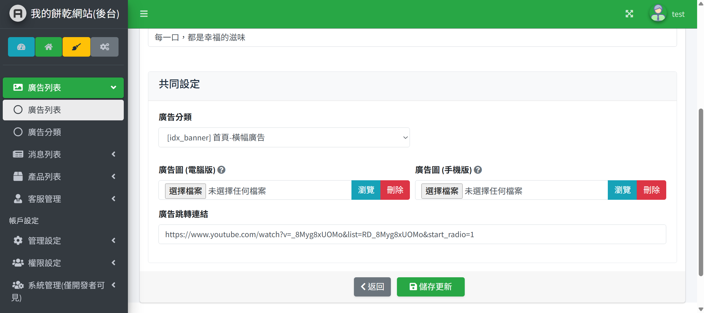
  * **功能描述**: 維護全站輪播圖、廣告橫幅及其分類，並深度整合多語系關聯。
  * **特殊邏輯**:
    - 廣告本體與分類抽離（`AdvertCategory`），支援同一組廣告依區塊與排序設定投遞。
    - 多語系欄位獨立儲存於 `AdvertDesc` 表，確保前台切換語系時內容即時同步。
  * **防呆與參數**: 圖片限制最大 2MB、格式限 jpg, png，路徑統一由 `ImageHelper` 代碼端控制，非人為任意輸入。
  * **可操作角色**: `內部最高管理員`、具備廣告管理權限之`客戶管理員`。

  #### 2. 最新消息公告管理 (News Management)
  * **介面預覽**: 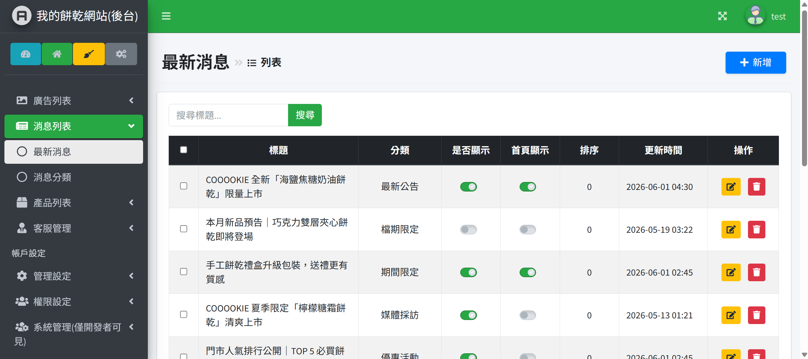
  * **功能描述**: 管理網站活動、最新公告資訊，可以設定要不要上架、或要不要在首頁置頂。
  * **特殊邏輯**: 分類、消息主體、多語系描述（`NewsDesc`）分離，降低主表複雜度。
  * **可調整參數**: 支援修改排序權重、決定是否同步顯示於前端首頁。

  #### 3. 產品型錄管理 (Product Catalog)
  * **介面預覽**: 
  * **功能描述**: 維護【COOOOKIE】全站手工餅乾品項、分類與詳細說明。
  * **處理的邏輯**: 寫產品介紹的編輯器有整合 `SummernoteImageHelper`，會自動把產品內容裡的圖片轉存到實體硬碟，不會讓資料庫因為塞滿圖片網址的編碼而變得很卡。

  #### 4. 客服聯絡管理 (Contact Customer Service)
  * **介面預覽**: 
  * **功能描述**: 集中審查前台留言，並可直接進行線上回覆。
  * **處理的邏輯**: 回覆確認送出後，系統會自動加入佇列（`Queue`），透過 `Mail/ContactNotification` 發送非同步電子郵件給用戶，保障操作介面流暢、不卡頓。

  #### 5. 語系核心設定 (Language Settings)
  * **介面預覽**: 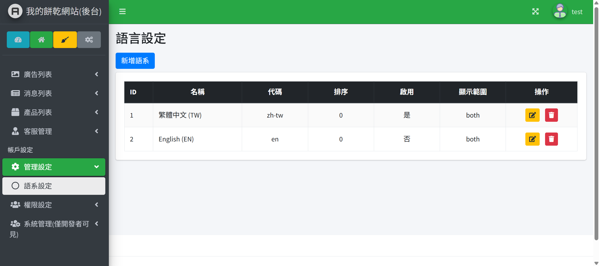
  * **功能描述**: 控管全站前台所支援的語言種類與預設語系切換。
  * **操作特性**: 新增或移除語系將即時反映於全站多語系欄位表（`Desc Tables`）的存取基礎。

  #### 6. 管理員安全稽核紀錄 (Action Logs)
  * **介面預覽**: 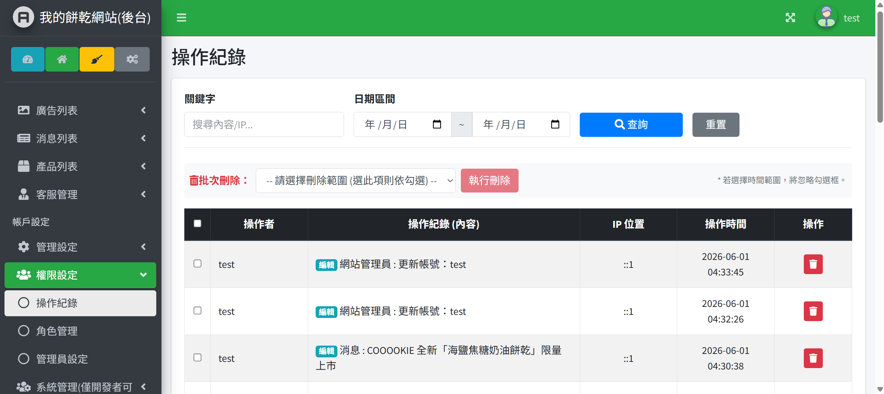
  * **功能描述**: 全自動跟蹤並記錄後台管理員的一舉一動，防範內部越權或操作失誤。
  * **處理的邏輯**: 套用 `Loggable` Trait，無需在每個 Controller 寫重複程式碼，系統會在 CRUD 發生時自動擷取操作人、時間與變更內容。

  #### 7. 角色權限矩陣管理 (Role & RBAC)
  * **介面預覽**: 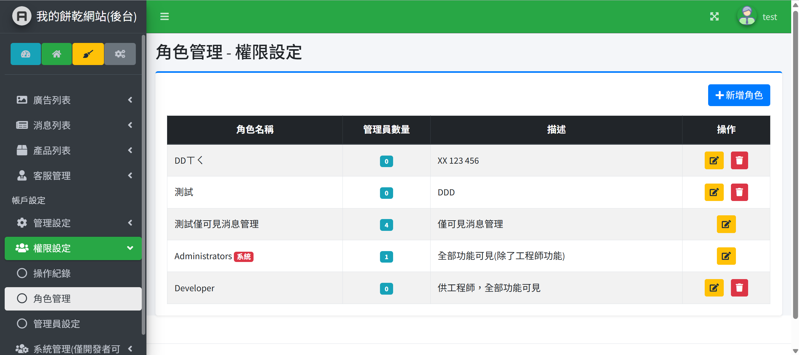
  * **功能描述**: 設定不同的職位（例如：一般小編、最高主管），並勾選他們各自可以看到後台的哪些選單。
  * **核心邏輯**: 變更權限後，系統透過 `CheckBackendPermission` Middleware 進行即時路由攔截，阻斷非法越權存取。

  #### 8. 後台帳號控管 (Admin Users)
  * **介面預覽**: 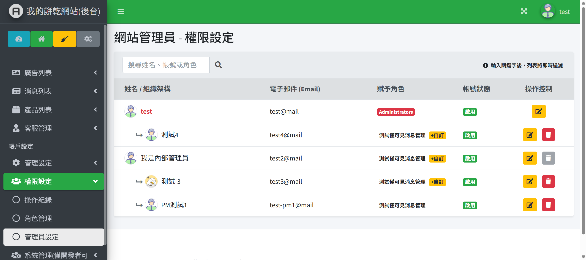
  * **功能描述**: 後台帳號的生命週期管理（新增、停用、指派角色）。
  * **特殊邏輯**: 為防止系統癱瘓，限制非開發員角色不得更動或刪除初始`開發員`帳號。

  #### 9. 系統log紀錄 (System Logs)
  * **介面預覽**: 
  * **功能描述**: 僅供開發人員查看。如果系統底層有任何錯誤、警告或異常，這裡都會顯示出來，可以用關鍵字或錯誤層級篩選，方便快速抓 Bug。

  #### 10. 通用通用圖片上傳組件 (Universal Image Uploader)
  * **介面預覽**: 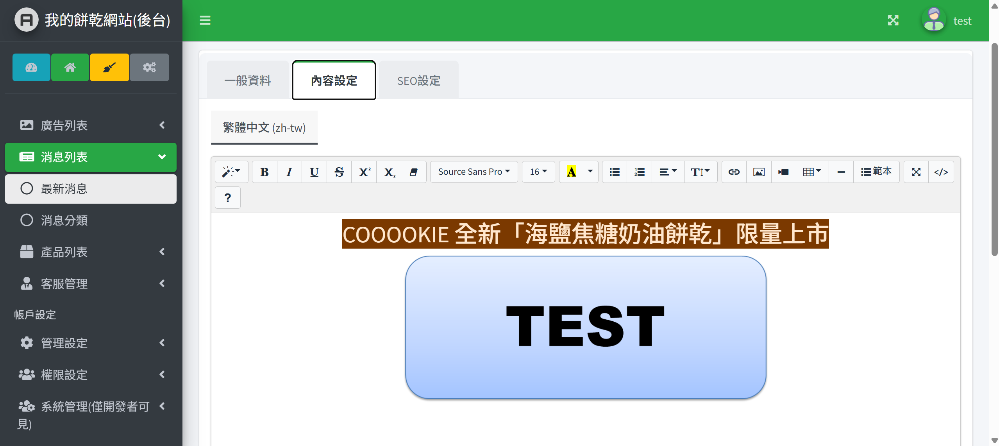
  * **功能描述**: 橫跨廣告、產品、消息的中央圖片處理引擎。
  * **處理的邏輯**: 由 `ImageHelper` 獨家控管，自動執行檔名唯一化雜湊（Hash）、強制壓縮並分流儲存於 `public/storage/adv/` 或 `public/storage/product/`，避免目錄混亂。

  ---

  ### B. 前台使用者介面 (Frontend UI/UX) 與風格說明

  #### 1. 首頁 (Home Page)
  * **頁面預覽**: 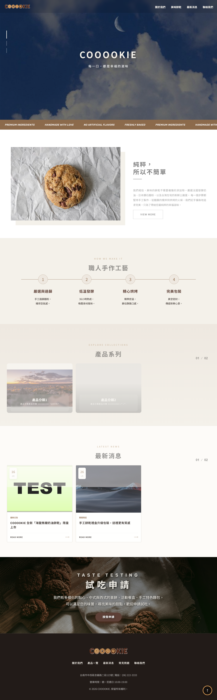
  * **視覺風格**: 採用溫暖的手作餅乾品牌主色，版面區塊（Banner 輪播、精選商品、最新消息）動態交織，傳遞高品質形象。
  * **前端互動**: jQuery 動態驅動 Banner 輪播切換，點擊卡片平滑導向詳情頁。

  #### 2. 商品型錄列表 (Product List)
  * **頁面預覽**: 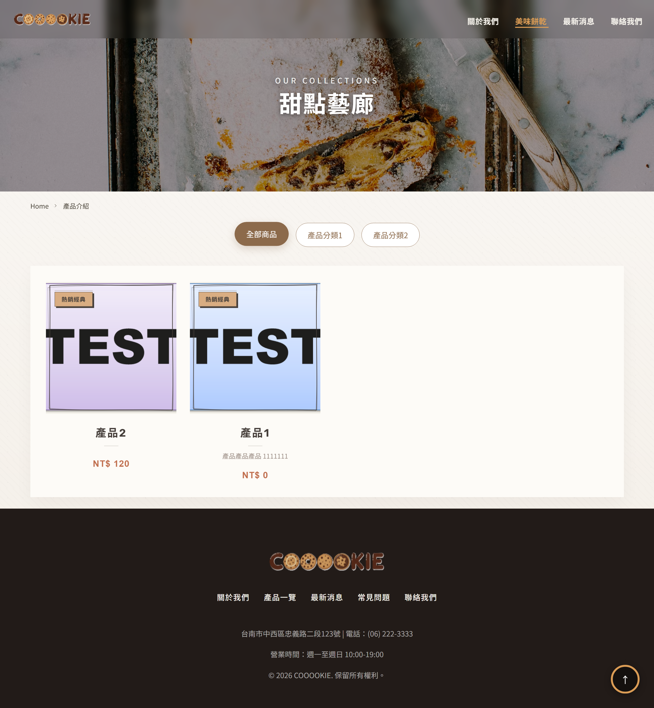
  * **排版結構**: 採標準的**網格卡片式 (Card Grid)** 排版，兼顧視覺飽滿度與 RWD 適應性。
  * **前端互動**: 無重新整理的 jQuery 分類無縫篩選、即時排序與響應式分頁組件。
  * **結構化標籤**: 採用 `<article>` 與合理 Heading 階層，優化 Google 機器人爬取效率。

  #### 3. 商品詳情頁 (Product Detail)
  * **頁面預覽**: 
  * **呈現方式**: 採左圖右文的大氣排版。左側產品圖支援 jQuery 點擊互動放大與多圖切換，右側重點商品規格加粗顯示。

  #### 4. 最新消息公告 (News Center)
  * **頁面預覽**: 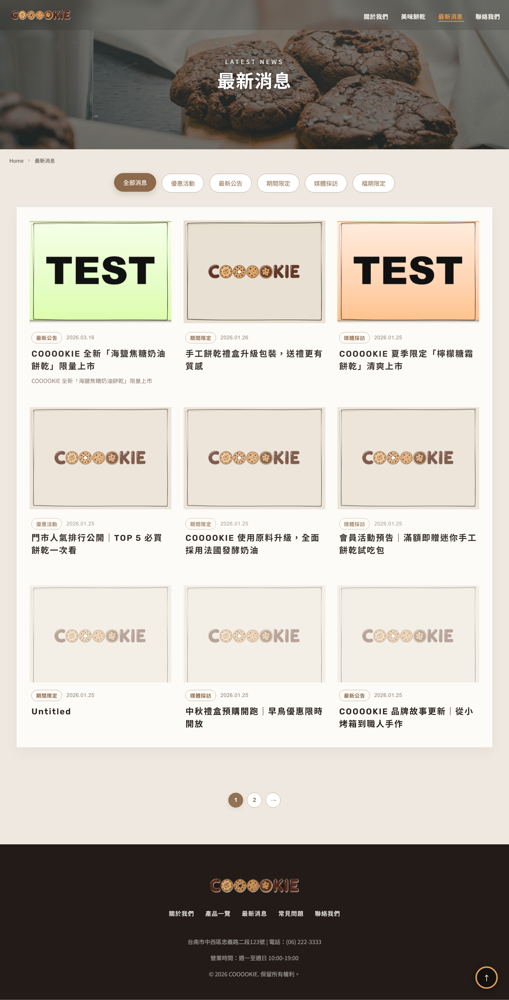
  * **呈現方式**: 清晰的清單/卡片混合流，標題按時間權重清晰排列。支援按消息類別進行前端快速過濾。

  #### 5. 聯絡我們表單 (Contact Us)
  * **頁面預覽**: 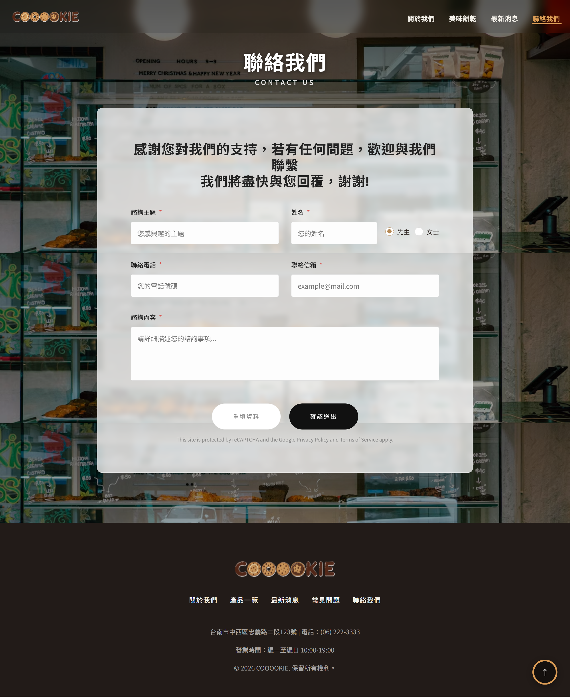
  * **互動亮點**: 具備即時前端 jQuery 表單欄位不為空與 Email 格式防呆驗證。按下送出按鈕後，按鈕自動進入 `disabled`（禁用狀態）並顯示「處理中...」，防止使用者重複點擊造成後端重複寫入資料。
